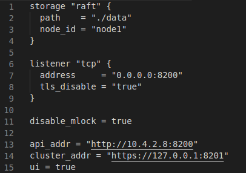

# Blockchain Automation Framework 

The Blockchain Automation Framework (BAF) is a tool designed for the deployment of DLT Networks in virtualized environments. In the context of the 5GZORRO project the Blockchain Automation Framework was used to deploy the Corda Network of the 5GZORRO Marketplace.

## Prerequisites

### System Requirements
- K8s <= v1.20
- Github ssh key
- Github Personal Access Token
- Docker Hub credentials
- VM with 1vCPU, 2GB RAM and 20 GB storage
- Bidirectional connectivity between Kubernetes Cluster and VM
- Docker

### Software dependenciess

### 5GZORRO Module dependencies

## Installation

### Setting up Longhorn storage for K8s
Install longhorn in the Kubernetes Cluster following [the official documentation](https://longhorn.io/docs/1.2.2/deploy/install/install-with-kubectl/).

### Setting up HashiCorp Vault 

Connect to the VM of the prerequisites and perform the following steps:

```bash
curl -fsSL https://apt.releases.hashicorp.com/gpg | sudo apt-key add -
sudo apt-add-repository "deb [arch=amd64] https://apt.releases.hashicorp.com $(lsb_release -cs) main"
sudo apt-get update && sudo apt-get install vault=1.7.1
mkdir vault
cd vault
nano config.hcl
```

```bash
mkdir data
nohup vault server -config=config.hcl &
export VAULT_ADDR='http://127.0.0.1:8200'
vault operator init -key-shares=1 -key-threshold=1
vault operator unseal << unseal-key-from-above >>
vault login << give the root token >>
vault secrets enable -version=1 -path=secret kv
```

### Fork and clone BAF repository
Clone the BAF repo forked in your Github account profile and enter in the downloaded folder.

### Setting up the Dockerfile
The `Dockefile.jdk8` file can be used to build the image of the container that, once executed, will perform the steps needed for the deployment of the Corda Network in the targeted K8s cluster.
Build the docker image with `docker build . -f Dockerfile.jdk8 -t hyperledgerlabs/baf-build`

### Setting up deployment details
Create a folder ``build/` with the following content:
- kubeconfigs file for the Kubernetes clusters to be used
- gitops file containing the Github ssh private key
- network.yaml file
- cordapp folder

The `network.yaml` is the most important file among them all since it is the one containing the structure of our Corda Network.
Use the template folder of the repository to create your build folder. Taking into account the template file for the network.yaml file, the only things that need to be changed are:

- username and password in the docker configuration section
- uri of the doorman and network-map services in the network_services section
- context and config_file in the k8s configuration sections
- url and root_token in the vault configuration sections
- username, password (github personal access token), git_url and git_repo in the gitops sections

### Run the deployment container
Run the docker image previously built from the BAF root folder with `docker run --network host --device=/dev/net/tun --cap-add=net_admin -it -v $(pwd):/home/blockchain-automation-framework/ hyperledgerlabs/baf-build`

## Configuration
No particular configurations are needed.

## Maintainers
**Michael De Angelis** - *Develop and Design* - m.deangelis@nextworks.it </br>

## License
This module is distributed under [Apache 2.0 License](LICENSE) terms.